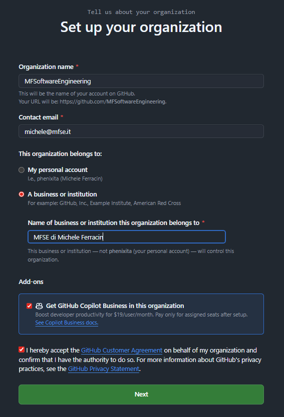
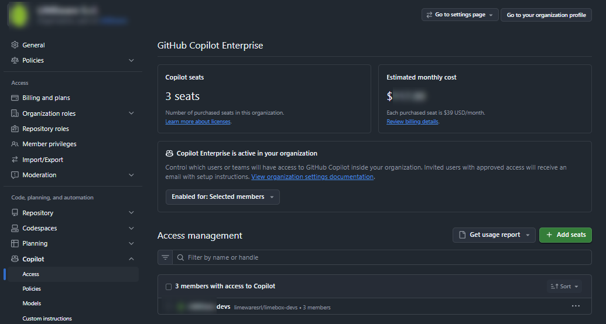
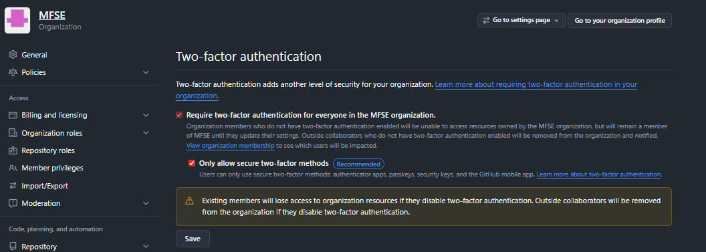

# Organization setup

To run these workshops in a company context, we set up a GitHub Organization if one is not already present.

## What is an organization

A GitHub organization is a shared “container” where a team, company, or community keeps their repositories, people, and permissions together under a single name (for example, `github.com/company-name`). [docs.github](https://docs.github.com/en/organizations/collaborating-with-groups-in-organizations/about-organizations)

### What it is in practice

- It is a type of account separate from personal accounts, with its own name, logo, and settings. [docs.github](https://docs.github.com/en/organizations/collaborating-with-groups-in-organizations/about-organizations)
- Inside an organization, you can have many repositories, public or private, linked to the same group or company. [github](https://github.com/orgs/community/discussions/69020)
- Users join with their personal account but work “inside” the organization. [docs.github](https://docs.github.com/en/organizations/collaborating-with-groups-in-organizations/about-organizations)

### What is it for

- **Team management**: define roles (owner, maintainer, member), create teams with different permissions (read-only, write, admin) on groups of repos. [github](https://github.com/orgs/community/discussions/69020)
- Centralize projects: all company or product repos are in the same space, organized and easy to find (avoiding many repos scattered among personal accounts). [it.scribd](https://it.scribd.com/document/513270621/github-guide-to-organizations)
- Control access: when someone joins or leaves the team, you grant or revoke access once at the organization level, without managing individual invites on each repo. [github](https://github.com/orgs/community/discussions/69020)
- Give identity to the code: projects are released with the organization “brand” (useful for companies, OSS, communities). [docs.github](https://docs.github.com/en/organizations/collaborating-with-groups-in-organizations/about-organizations)
- Use advanced tools: you can configure security policies, GitHub Actions, GitHub Projects, issues, common templates, etc. at the organization level. [nethesis](https://www.nethesis.it/approfondimenti/open-source/github-cos-e)

## Setup

### Create GitHub accounts for developers

Each workshop participant need a GitHub account (free).

[Here you can create a GitHub account](https://github.com/signup).

Reference: [creating an account](https://docs.github.com/en/get-started/start-your-journey/creating-an-account-on-github).

### Create Organization

1. Go to new org page to create a [new organization for free](https://github.com/account/organizations/new?plan=free).
1. Select "a business or institution"
1. Add-ons: activate Copilot Business in this organization

### Add users to your Organization

Add users account to manage them centrally in your organization later.

Search by user name and then "Complete Setup".

### Activate GitHub Copilot

Check, edit and save your billing information. Nothing is charged to you until you actively assign seats later.

### Assign copilot seats

Assign copilot seats to your users (all or selected based on your scenario).

Example:

1. Filter or search members
1. Check 
1. Continue to purchase.

If everything is setup properly you should see something like this.

Visit: `https://github.com/organizations/<your-org>/settings/copilot/seat_management`

### Enable two-factor authentication (recommended)

It is recommended to require two-factor authentication (2FA) for your organization to improve security.

Reference: [requiring two-factor authentication in your organization](https://docs.github.com/en/organizations/keeping-your-organization-secure/managing-two-factor-authentication-for-your-organization/requiring-two-factor-authentication-in-your-organization)

1. Go to Authentication -> Security for your org `https://github.com/organizations/<your-org>/settings/security` 
1. Activate `Require two-factor authentication for everyone` 

### Install Visual Studio Code and Copilot extension

Each workshop participant needs Visual Studio Code and the GitHub Copilot extension installed.

1. Download and install Visual Studio Code from [code.visualstudio.com](https://code.visualstudio.com/).
1. Open Visual Studio Code, go to Extensions, and search for "GitHub Copilot".
1. Install the extension and sign in with the GitHub account used in the organization.

