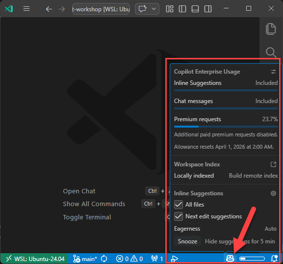

# Workshop 1 — Set up GitHub Copilot in VS Code


> **Estimated time: 60 minutes** (5 exercises)
>
> **Difficulty: low** — this workshop guides you through the complete setup of GitHub Copilot in VS Code, from account activation to advanced customization with custom instructions and agent. You'll start from the base installation and end up using Copilot as a true coding companion.

AI-Assisted Development — Module 1 of 3

## Terms and Conditions of Use

This training package is proprietary and confidential and is intended exclusively for the uses described in the training materials. Copying or disclosing all or part of the content and/or software included in these packages is prohibited. The contents of this package are for informational and training purposes only and are provided "as is" without warranties of any kind, express or implied, including, but not limited to, the implied warranties of merchantability, fitness for a particular purpose, and non-infringement. The content of the training package, including URLs and other references to Internet websites, is subject to change without notice. Unless otherwise noted, the companies, organizations, products, domain names, email addresses, logos, people, places, and events depicted herein are fictitious and no association with any real company, organization, product, domain name, email address, logo, person, place, or event is intended or should be inferred.

---

## The Scenario

You are about to enter the world of AI-assisted development. GitHub Copilot is your new coding companion: it suggests code inline, answers your questions in chat, and can even analyze your project to generate code consistent with your practices. In this workshop you will configure everything from scratch, starting from account activation all the way to advanced customization.

> **Remember:** to use Copilot in VS Code you need a GitHub account with access to GitHub Copilot. If you don't have a subscription yet, the **Copilot Free** plan will be automatically activated with a monthly limit of inline suggestions and chat interactions.

---

## Exercise 1: Activation and First Access to GitHub Copilot

This exercise guides you through activating GitHub Copilot within Visual Studio Code, from the first click to confirming that everything is working correctly.

### Prerequisites

Before starting, make sure you have:

- **Visual Studio Code** installed and updated to the latest stable version
- An active **GitHub account** (if you don't have one, create it at [github.com](https://github.com))
- A stable **internet connection**

### Objective

1. Activate GitHub Copilot in VS Code via the icon in the Status Bar
2. Complete the authentication flow with your GitHub account
3. Verify that Copilot is active and working 

**Step 1 — Locate the Copilot icon**

- Open Visual Studio Code
- In the **Status Bar** (the bar at the bottom), locate the Copilot icon (a small sparkle/copilot symbol)
- Hover over the icon: a tooltip with available options will appear

**Step 2 — Enable AI features**

- Click on the Copilot icon in the Status Bar
- Select **"Use AI Features"** from the context menu
- An authentication window will open: choose the sign-in method (browser or device code) and follow the prompts
- Authorize VS Code to access your GitHub account

**Step 3 — Verify your subscription**

- If you already have a Copilot subscription (Individual, Business, or Enterprise), VS Code will use it automatically
- If you don't have a subscription, you'll be signed up for the **Copilot Free** plan: you'll receive a monthly limit of inline suggestions and chat interactions
- Check in the Status Bar that the Copilot icon is now active (not grayed out/disabled)

**Step 4 — Quick first test**

- Create a new file (for example `test.js`)
- Start writing a function, for example: `function calculateAverage(`
- Observe: Copilot should suggest a completion in gray (ghost text)
- Press **Tab** to accept the suggestion, or **Esc** to dismiss it

### Success Criteria

- [ ] The Copilot icon in the Status Bar is active 
- [ ] You have completed the authentication with your GitHub account
- [ ] Copilot generates inline suggestions when you write code in a new file

---

## Exercise 2: Configuring Telemetry and Settings

This exercise guides you through configuring the privacy and telemetry settings of GitHub Copilot, an important step for conscious use of the tool in an enterprise context.

### Prerequisites

Before starting, make sure you have:

- GitHub Copilot activated and working (Exercise 1 completed)

### Objective

1. Understand the telemetry settings of the free version of Copilot
2. Configure telemetry preferences in VS Code
3. Review and adjust settings related to suggestions matching public code

> **Important:** in the free version of GitHub Copilot, telemetry is enabled by default. Code suggestions that match public code (including code references in the VS Code and github.com experience) are allowed by default.

**Step 1 — Check telemetry settings in VS Code**

- Open VS Code settings: `File > Preferences > Settings` (or `Ctrl+,` / `Cmd+,`)
- Search for `telemetry.telemetryLevel`
- Available levels are: `all`, `error`, `crash`, `off`
- To disable telemetry, set the value to `off`

> **Note:** if your organization manages this setting centrally, you may not be able to change it.

### Success Criteria

- [ ] You have verified the telemetry level set in VS Code 

---

## Exercise 3: Customizing Commit Message Generation

Every commit tells a story. Poorly written commit messages ("fix stuff", "WIP", "asdf") make code history unreadable and slow down code reviews, incident investigations, and changelog generation. Copilot can generate commit messages automatically — and this exercise shows you how to teach it your team's exact conventions, combining a shared Markdown instruction file with inline rules in `settings.json`.

### Prerequisites

Before starting, make sure you have:

- GitHub Copilot activated and working (Exercise 1 completed)
- A Git repository open in VS Code (any project with at least a few staged changes)

### Objective

1. Understand how `github.copilot.chat.commitMessageGeneration.instructions` works and why it supports both files and inline text
2. Create the shared instruction file `.github/copilot-commit-message-instructions.md`
3. Configure the setting in `settings.json` with the file reference and three inline rules
4. Generate a commit message and verify that Copilot follows your conventions

### Background: Two Ways to Give Instructions

The `github.copilot.chat.commitMessageGeneration.instructions` setting accepts an **array of instruction sources**. Each item in the array can be one of two types:

| Type           | Key                | When to use                                                                          |
| -------------- | ------------------ | ------------------------------------------------------------------------------------ |
| File reference | `"file": "<path>"` | Team-wide conventions that belong in version control and can be reviewed in PRs      |
| Inline text    | `"text": "<rule>"` | Short, personal, or environment-specific rules that live only in your local settings |

Copilot merges all sources in order, so the file's content is applied first, and the inline rules are appended on top. This lets you share a base convention across the whole team (via the file checked into `.github/`) while still allowing individuals or CI environments to add their own constraints locally.

---

**Step 1 — Create the shared instruction file**

In your project root, create the file `.github/copilot-commit-message-instructions.md` with the following content:

```markdown
# Copilot Commit Message Instructions

Follow the Conventional Commits specification: https://www.conventionalcommits.org/

## Format

<type>(<scope>): <subject>

[optional body]

[optional footer]

## Types

- feat: a new feature
- fix: a bug fix
- docs: documentation changes only
- style: formatting, missing semicolons, etc. (no logic change)
- refactor: code restructuring without behaviour change
- test: adding or updating tests
- chore: build process, dependency updates, tooling

## Rules

- Use the imperative mood in the subject ("add feature" not "added feature")
- Do not end the subject line with a period
- Separate subject from body with a blank line
- Wrap body lines at 72 characters
- Use the body to explain *what* and *why*, not *how*
```

> **Why a file?** Storing team conventions in `.github/copilot-commit-message-instructions.md` means they are versioned alongside your code. When the team agrees to change a rule, a PR updates the file and everyone gets the new instructions automatically at their next pull.

**Step 2 — Open your user `settings.json`**

- Open the Command Palette (`Ctrl+Shift+P` / `Cmd+Shift+P`)
- Type `Preferences: Open User Settings (JSON)` and press Enter

**Step 3 — Add the commit message instructions setting**

Add the following block to your existing `settings.json`. Place it alongside the settings from Exercise 4:

```jsonc
{
    "chat.agent.maxRequests": 250,
    "chat.customAgentInSubagent.enabled": true,
    "github.copilot.chat.commitMessageGeneration.instructions": [
        {
            "file": ".github/copilot-commit-message-instructions.md"
        },
        {
            "text": "Keep subject line under 50 characters"
        },
        {
            "text": "Include scope when relevant (e.g., api, ui, auth)"
        },
        {
            "text": "Reference issue numbers with # prefix"
        }
    ]
}
```

**Understanding each entry:**

The `"file"` entry points Copilot to the shared Markdown file you just created. The path is relative to the workspace root. Copilot reads this file at generation time, so edits to the file take effect immediately without touching `settings.json`.

The three `"text"` entries are **inline rules** layered on top of the file. They are intentionally short and precise:

- *"Keep subject line under 50 characters"* — the 50-character limit is a Git convention that keeps messages readable in `git log --oneline` and in GitHub's commit list UI. Anything over 72 characters gets truncated.
- *"Include scope when relevant (e.g., api, ui, auth)"* — scope makes it immediately clear which part of the codebase a commit touches, without reading the diff. Examples: `fix(auth): handle token expiry`, `feat(api): add pagination to /orders`.
- *"Reference issue numbers with # prefix"* — GitHub and Azure DevOps both parse `#123` in commit messages and automatically link the commit to the corresponding issue or work item. This creates traceability from code history back to the original requirement.

**Step 4 — Generate a commit message and verify**

- Make a small change to any file in your project and stage it (`git add`)
- Open the **Source Control** panel in VS Code (the branch icon in the sidebar)
- Click the sparkle ✨ icon next to the commit message input field (*"Generate Commit Message"*)
- Copilot will analyse the staged diff and produce a message following your instructions
- Check that the generated message:
  - Uses a Conventional Commits type (`feat`, `fix`, `docs`, etc.)
  - Has a subject line of 50 characters or fewer
  - Includes a scope in parentheses if the change touches a specific area
  - Contains a `#` issue reference if one is relevant (you may need to add it manually if no issue context is available)

> **Note:** if the sparkle icon is not visible, make sure you are in the commit message text box and that Copilot is active. You can also trigger generation via the Command Palette: `GitHub Copilot: Generate Commit Message`.

### Success Criteria

- [ ] The file `.github/copilot-commit-message-instructions.md` exists in your project with Conventional Commits conventions
- [ ] Your `settings.json` contains the `github.copilot.chat.commitMessageGeneration.instructions` array with the file reference and three inline rules
- [ ] You can explain the difference between a `"file"` entry and a `"text"` entry, and when you would use each
- [ ] Copilot has generated at least one commit message that respects the 50-character subject line limit and uses a Conventional Commits type
 

---

## Exercise 4: Configuring Agent Mode for Advanced AI Features

This exercise guides you through enabling and tuning Agent Mode, which unlocks Copilot's ability to run autonomous workflows and create specialized subagents. Agent Mode allows Copilot to make multiple requests in a single chat session and to invoke custom agents you create for domain-specific tasks.

### Prerequisites

Before starting, make sure you have:

- GitHub Copilot activated and working (Exercise 1 completed)

### Objective

1. Understand what Agent Mode enables in Copilot
2. Configure `chat.agent.maxRequests` to allow multiple autonomous requests
3. Enable subagent support for custom agent creation
4. Verify that Agent Mode is working

### Background: What Is Agent Mode?

Agent Mode represents an evolution beyond simple code completion or single-turn chat. It enables two powerful capabilities:

| Setting                           | What It Does                                                                         |
| --------------------------------- | ------------------------------------------------------------------------------------ |
| `chat.agent.maxRequests`          | Sets the maximum number of sequential requests Copilot can make in a single session |
| `chat.customAgentInSubagent.enabled` | Allows Copilot to invoke custom agents (from `.agent.md` files) as subagents        |

By default, these are either disabled or set to conservative limits. Tuning them unlocks:

- **Multi-step workflows**: Copilot can research, implement, test, and adjust code across multiple turns without you manually triggering each step
- **Custom specialized agents**: You can define domain-specific agents (for DevOps, documentation, testing, etc.) and Copilot will invoke them automatically when relevant
- **Improved debugging**: Copilot can run multiple diagnostic checks and propose fixes iteratively

---

**Step 1 — Open your user `settings.json`**

- Open the Command Palette (`Ctrl+Shift+P` / `Cmd+Shift+P`)
- Type `Preferences: Open User Settings (JSON)` and press Enter

**Step 2 — Add Agent Mode configuration**

Within your existing `settings.json`, add or update the following settings:

```jsonc
{
    "chat.agent.maxRequests": 250,
    "chat.customAgentInSubagent.enabled": true
}
```

**Understanding each setting:**

- `"chat.agent.maxRequests": 250` — sets the maximum number of AI requests Copilot can make during a single chat session. The value `250` is a reasonable production setting that allows complex multi-step workflows while preventing runaway costs. You can adjust the number based on your needs (minimum `1`, no maximum). Higher values allow longer, more autonomous research and iteration.

- `"chat.customAgentInSubagent.enabled": true` — enables Copilot to discover and invoke custom agents you define in `.agent.md` files. When enabled, Copilot can automatically route requests to the best agent for the task at hand.

**Step 3 — Save and verify**

- Save the settings file (`Ctrl+S` / `Cmd+S`)
- VS Code will apply the settings immediately; no restart needed

**Step 4 — Test Agent Mode in Copilot Chat**

- Open the Copilot Chat panel (click the chat icon in the sidebar or press `Ctrl+L`)
- Ask Copilot a multi-step question, for example:
  - *"Analyze this project structure and suggest a testing strategy. Then create a sample test file for the main module."*
  - *"Find all console.log statements in my code, explain why they should be removed, and generate a refactored version without them."*
- Observe: Copilot should now be able to:
  - Make multiple requests in sequence without you manually intervening
  - Plan and execute multi-step tasks
  - Provide iteration and refinement without stopping

> **Note:** if you have created custom agents (in Exercise 6), Copilot will also automatically consider invoking them as part of its workflow.

### Success Criteria

- [ ] Your `settings.json` contains both `chat.agent.maxRequests` (set to a value like `250`) and `chat.customAgentInSubagent.enabled` (set to `true`)
- [ ] You can explain what Agent Mode enables (multi-step workflows and custom agent invocation)
- [ ] You have tested Copilot Chat with a multi-step request and observed that Copilot can complete it without requiring multiple manual interventions
- [ ] You understand that higher `maxRequests` values enable longer workflows but consume more API quota

---

## Summary: What You Have Configured

After this workshop, your environment is ready for AI-assisted development:

| Component           | Status       | Notes                                         |
| ------------------- | ------------ | --------------------------------------------- |
| **GitHub Account**  | ✅ Connected  | Authentication completed in VS Code           |
| **GitHub Copilot**  | ✅ Active     | Inline suggestions working                    |
| **Telemetry**       | ✅ Configured | Level chosen consciously                      |
| **Copilot Chat**    | ✅ Working    | Chat panel accessible                         |
| **Agent Mode**      | ✅ Tuned      | `maxRequests` and subagent support configured |
| **Commit Messages** | ✅ Customized | Conventional Commits via file + inline rules  |

### What To Do Next

Before moving into advanced planning or customizations, build your day-to-day operating habits with the new Getting Started module:

- Continue with `02-Getting-started/workshop-02.1-vscode-quickstart.md`
- Then complete `02-Getting-started/workshop-02.2-tools-and-control.md`

These two workshops focus on the fundamentals that make the later modules easier:

- starting and scoping chat sessions in a real repository
- choosing between `Auto`, fast, and reasoning models
- using file, folder, and symbol references as context
- reviewing tool calls, approvals, and small edits before accepting them

### The Golden Rule

> Copilot is a **companion**, not a replacement. Every suggestion should be read, understood, and validated before being accepted. The responsibility for the code remains yours.
