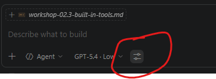
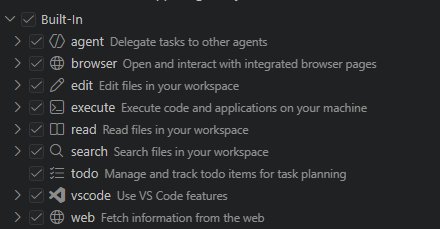

# Workshop 2.3 — Built-In Agent Tools in VS Code


> **Estimated time: 30 minutes** (2 exercises)
>
> **Difficulty: low to medium** — this workshop gives you hands-on practice with the built-in Copilot agent tools available in Visual Studio Code. You will learn when each tool is appropriate, how to trigger it intentionally, how to inspect tool usage in chat, and how to keep control through constrained requests and approvals.

AI-Assisted Development — Getting Started Module

## Terms and Conditions of Use

This training package is proprietary and confidential and is intended exclusively for the uses described in the training materials. Copying or disclosing all or part of the content and/or software included in these packages is prohibited. The contents of this package are for informational and training purposes only and are provided "as is" without warranties of any kind, express or implied, including, but not limited to, the implied warranties of merchantability, fitness for a particular purpose, and non-infringement. The content of the training package, including URLs and other references to Internet websites, is subject to change without notice. Unless otherwise noted, the companies, organizations, products, domain names, email addresses, logos, people, places, and events depicted herein are fictitious and no association with any real company, organization, product, domain name, email address, logo, person, place, or event is intended or should be inferred.

---

## The Scenario

Your team has started using Copilot Agent mode in VS Code, but people still treat tool usage as a black box. Some requests are over-privileged, some are too vague, and reviews happen too late. You want a shared operating model for built-in tools: what each tool is for, what risk it carries, and how to decide the minimum tool scope before asking Copilot to act.

In this workshop you will practice with the built-in tools visible in VS Code today:

- `read`
- `search`
- `vscode`
- `web`
- `browser`
- `edit`
- `execute`
- `todo`
- `agent`


Use this working model to frame the tool surface before starting the exercises:

| Group      | Tools                                        | Side effects    | Typical intent                                         |
| ---------- | -------------------------------------------- | --------------- | ------------------------------------------------------ |
| Inspection | `read`, `search`, `vscode`, `web`, `browser` | None or minimal | Understand code, editor state, and external references |
| Action     | `edit`, `execute`                            | Yes             | Apply file changes or run commands                     |
| Workflow   | `todo`, `agent`                              | Indirect        | Track multi-step work and delegate subtasks            |

> **Remember:** tool usage is a capability, not a mandate. Keep Copilot constrained to the minimum power needed for the current task.

---

## Exercise 1: Trigger an Inspection Flow Deliberately

This exercise teaches you to deliberately trigger inspection tools and verify that Copilot used the right ones.

### Prerequisites

Before starting, make sure you have:

- Chat open with tool visibility enabled
- A repository with at least a few source files
- Have all build-in tools selected (image below)




### Objective

Gaining confindence in selecting and calling tools.

**Step 1 — Trigger search + read**

Ask:

```
Find the entry point of this project and explain the startup flow in 5 bullet points.
```

- Check that Copilot used search/read oriented tools
- Expand tool details in chat and verify accessed files

**Step 2 — Trigger vscode context usage**

Open a file and select a code segment. Then ask:

```
Explain the selected code segment.
```

- Check whether the request used editor-aware context (vscode tool behavior)


### Success Criteria

- [ ] You intentionally triggered an inspection-oriented tool flow
- [ ] You inspected tool details and validated what was accessed
- [ ] You can explain when editor-aware context improves answer quality

---

## Exercise 2: Disable `edit` and Prove Tool Control

This exercise demonstrates that agent behavior can be constrained by tool selection. You will ask for a file change while intentionally disabling the `edit` tool and observe how Copilot adapts.

### Prerequisites

Before starting, make sure you have:

- Chat open with tool visibility enabled
- A repository file where a small text change would be safe
- The tools picker available for the current request

### Objective

1. Disable the `edit` tool for a request that normally invites a file modification
2. Observe how Copilot responds when it cannot directly edit files
3. Confirm that tool scope meaningfully changes agent behavior

**Step 1 — Disable `edit` in the tools picker**

- Open the tools picker before sending the next prompt
- Deselect `edit`
- Keep inspection tools enabled so Copilot can still read the repository

**Step 2 — Ask for a file change anyway**

Ask:

```
Improve the wording of one paragraph in this file to make it clearer, but keep the meaning unchanged.
```

- Observe that the request asks for an edit even though the `edit` tool is unavailable
- Check whether Copilot responds with a proposed change, suggested text, or instructions instead of directly modifying the file

**Step 3 — Inspect the tool trace**

- Expand tool details in chat
- Verify that Copilot used read-oriented tools only
- Confirm that no file modification was performed

**Step 4 — Compare with `edit` enabled again**

- Re-enable `edit`
- Repeat the same request or a very similar one
- Compare the result with the previous run

**Step 5 — Record the lesson**

Write one sentence in your notes:

- "If a tool is disabled, the agent must adapt to that constraint instead of silently exceeding it."

### Success Criteria

- [ ] You sent a prompt that requested a file edit while `edit` was disabled
- [ ] You verified that Copilot did not modify files without the required tool
- [ ] You compared the constrained and unconstrained behaviors and explained the difference

---

## Summary: What You Have Practiced

After this workshop, you should be able to:

| Skill                  | Outcome                                                               |
| ---------------------- | --------------------------------------------------------------------- |
| Tool mapping           | Understand what each built-in tool is for and what risk it introduces |
| Intentional triggering | Prompt in ways that invoke the right tool class for the job           |
| Trace inspection       | Read tool-call details to verify behavior and scope                   |
| Tool control           | Constrain agent behavior by enabling only the tools required          |

### Next Step

- Continue with Workshop 4 to practice the dedicated planning flow for ambiguous or architectural work
- Continue with Workshop 6 to define custom agent personas with explicit tool boundaries

### Version Note

Built-in tool names or visibility can vary across VS Code and Copilot versions. If one tool is unavailable in your environment, document the difference and continue with the closest built-in equivalent.